## Ứng dụng WhatsApp sử dụng Realtime Firebase
Ứng dụng chat realtime cho mọi người. Có thể giúp người dùng tìm kiếm và kết bạn với người sử dụng app. Tạo group chat và kết nối với những người sử dụng app ,xem trạng thái người dùng. Khi chat có thể thêm hình ảnh, file tài liệu pdf, docx, có thể xóa tin nhắn.

## Nội dung
1. [Chức năng](#chức-năng)

   1. [Đăng nhập / Đăng kí](#đăng-nhập-/-đăng-kí)

   1. [Quản lí tài khoản](#quản-lí-tài-khoản)

   1. [Tìm kiếm người dùng khác](#tìm-kiếm-người-dùng-khác)

   1. [Thêm bạn bè và nhắn tin với người dùng](#thêm-bạn-bè-và-nhắn-tin-với-người-dùng)

   1. [Tạo group chat kết nối với mọi người dùng app](#tạo-group-chat-để-kết-nối-với-mọi-người-dùng-app)

   1. [Chat với bạn bè](#chat-với-bạn-bè)

   1. [Thêm hình ảnh và tài liệu khi chat](#thêm-hình-ảnh-và-tài-liệu-khi-chat)

   1. [Rút lại tin nhắn](#rút-lại-tin-nhắn)
   
   1. [Trạng thái hoạt động của bạn bè](#trạng-thái-hoạt-động-của-bạn-bè)

1. [Yêu cầu thiết bị](#yêu-cầu-thiết-bị)

1. [Thư viện và công nghệ](#thư-viện-và-công-nghệ)

1. [Tác giả](#tác-giả)

## Chức năng
### Đăng nhập / Đăng kí

  

   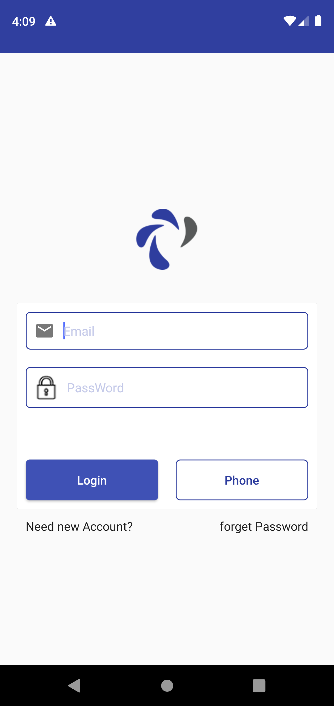 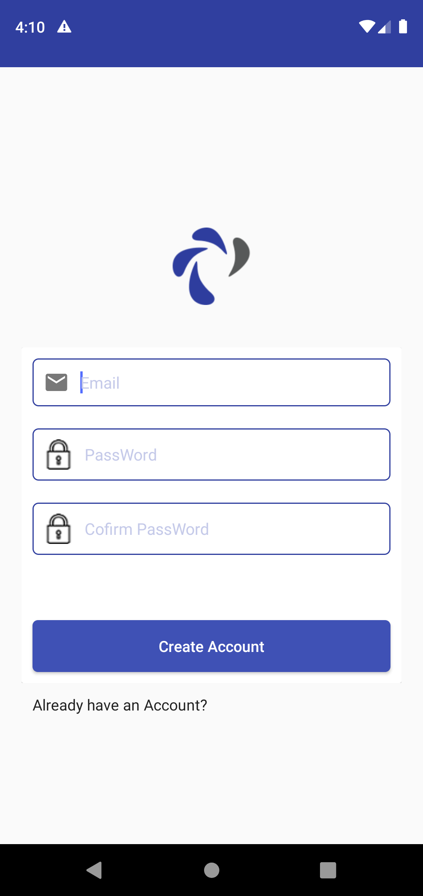
   

   
### Quản lí tài khoản

   * Thay đổi trạng thái
   
   

   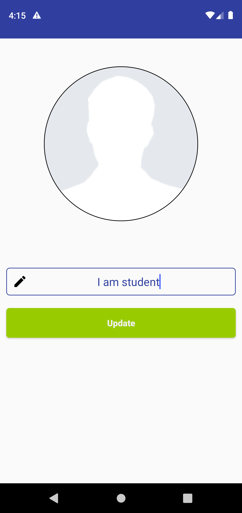 src="screenshots/image-profile.png" height = "480" width="270">
   

### Tìm kiếm người dùng khác
   
  

   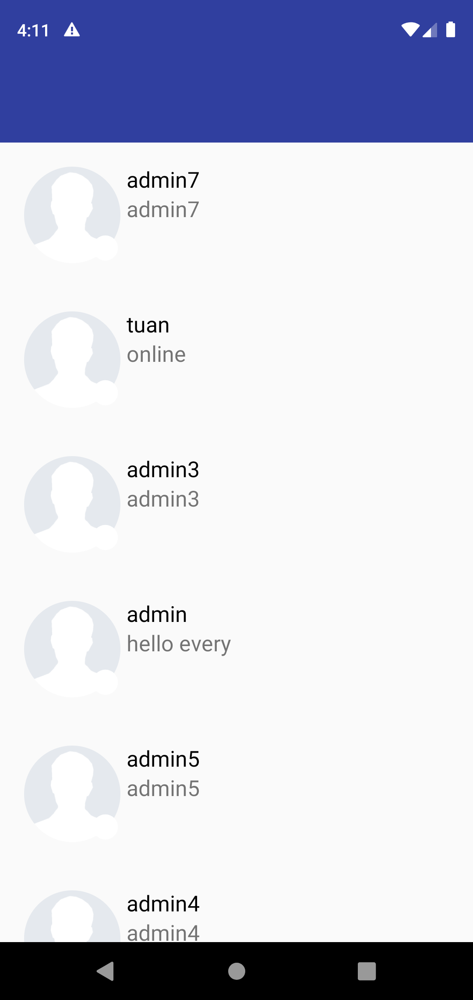
   

### Thêm bạn bè và nhắn tin với người dùng 

  

   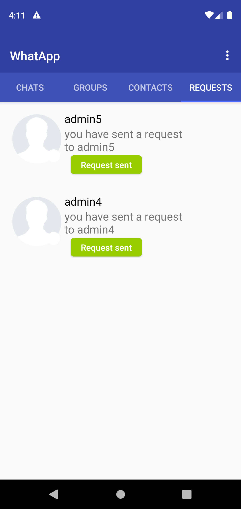 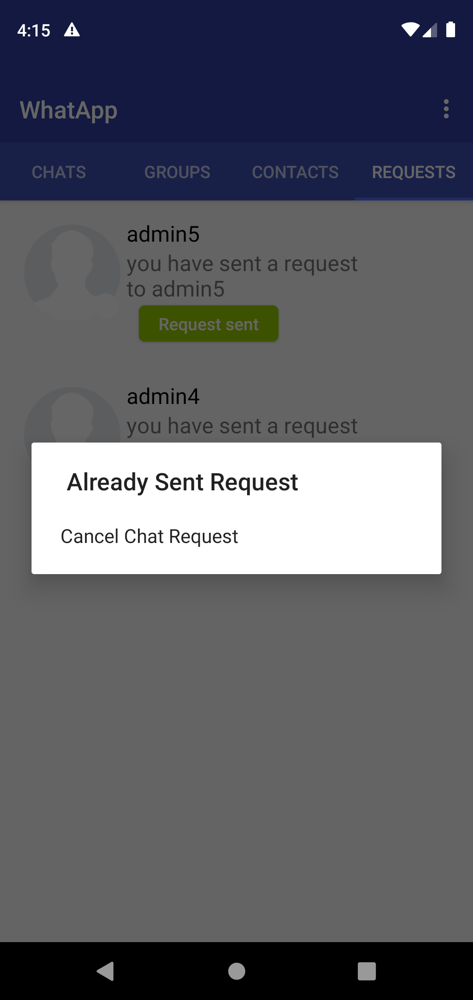
   

   
### Tạo group chat kết nối với mọi người dùng app

  

   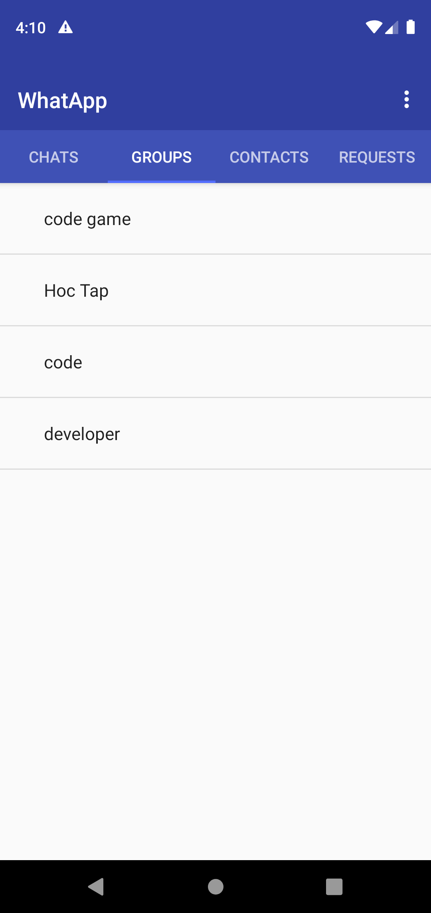 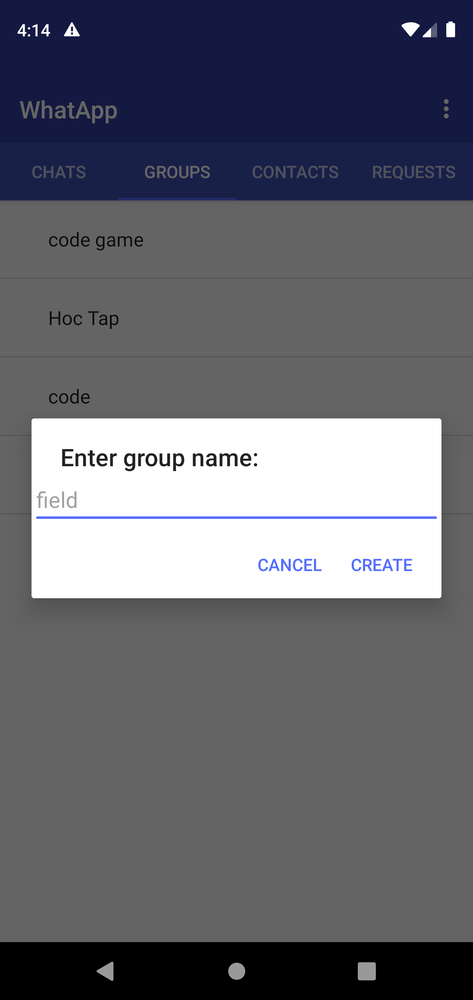 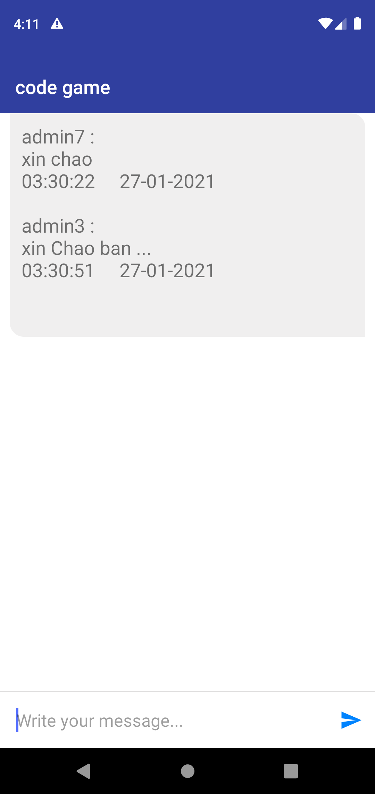
   

   
### Chat với bạn bè

  

   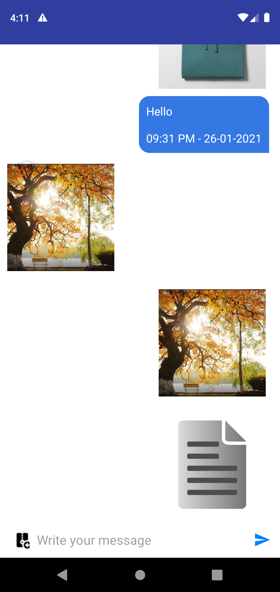
   

   
### Thêm hình ảnh và tài liệu khi chat

  

   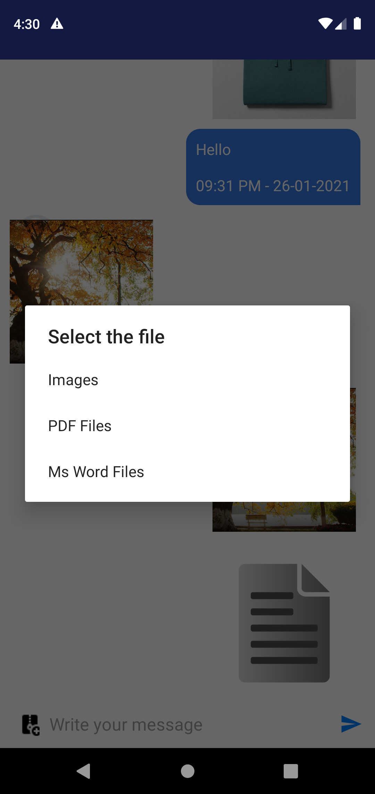  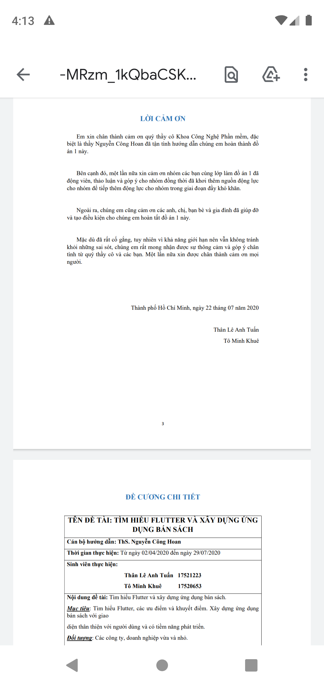
   

   
### Rút lại tin nhắn

  

   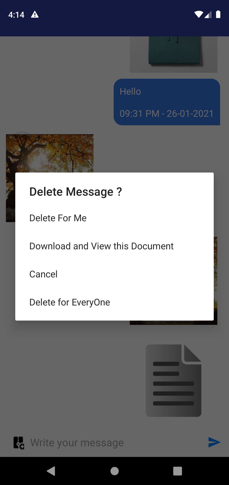
   

### Trạng thái hoạt động của bạn bè

  

    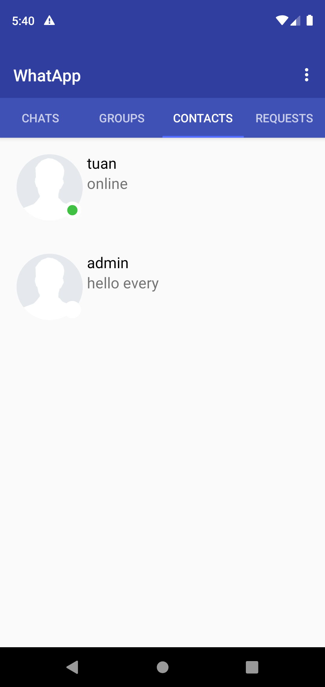
   

   
## Yêu cầu thiết bị

   +Android studio : 4.1

   +Gradle : 3.5.1

   +Min sdk : 16

   +Target sdk : 27

## Thư viện và công nghệ

- Language : java

- Database: realtime firebase

## Tác giả
Tô Minh Khuê - 17520653@gm.uit.edu.vn

Thân Lê Anh Tuấn - 17521223@gm.uit.edu.vn
